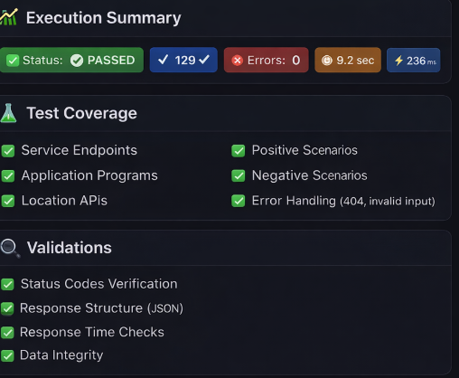
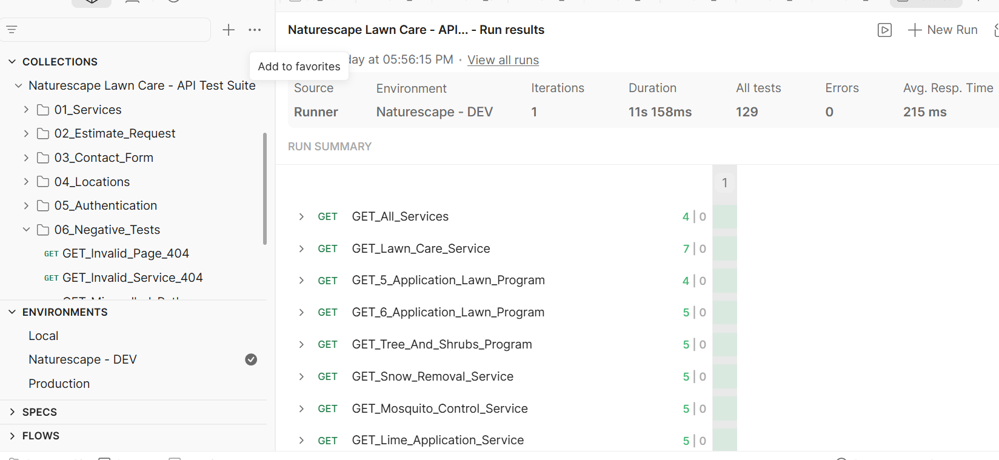

#  Naturescape Lawn Care — API Test Suite


A professional API testing suite built in **Postman** for the [Naturescape Lawn Care](https://naturescapelawncare.com) web application. This project demonstrates manual API testing skills including environment variable management, test scripting, negative testing, and authentication validation.

---

##  Execution Summary



---

##  Project Overview

| Item | Details |
|---|---|
| **Application Under Test** | Naturescape Lawn Care Website |
| **URL** | https://naturescapelawncare.com |
| **Testing Tool** | Postman |
| **Total Requests** | 25+ |
| **Total Tests** | 129 |
| **Test Pass Rate** | 100% ✅ |
| **Avg Response Time** | 215ms |
| **Test Type** | Manual API Testing |

---

##  Collection Structure
```
Naturescape Lawn Care - API Test Suite
│
├── 01_Services               # All service page GET requests (12 requests)
│   ├── GET_All_Services
│   ├── GET_Lawn_Care_Service
│   ├── GET_5_Application_Lawn_Program
│   ├── GET_6_Application_Lawn_Program
│   ├── GET_Tree_And_Shrubs_Program
│   ├── GET_Snow_Removal_Service
│   ├── GET_Mosquito_Control_Service
│   ├── GET_Lime_Application_Service
│   ├── GET_Lawn_Mowing_Service
│   ├── GET_Aeration_Service
│   ├── GET_Preventative_Grub_Control_Service
│   └── GET_Fall_Cleanup_Service
│
├── 02_Estimate_Request       # Get Started / Branch Info testing (5 requests)
│   ├── GET_Get_Started_Page
│   ├── GET_Branch_Info_By_Zip
│   ├── GET_Branch_Info_Invalid_Zip
│   ├── GET_Branch_Info_Missing_Zip
│   └── GET_Branch_Info_Invalid_Format
│
├── 03_Contact_Form           # Contact Us page testing (2 requests)
│   ├── GET_Contact_Us_Page
│   └── GET_Contact_Branch_Info_By_Zip
│
├── 04_Locations              # Location pages testing (2 requests)
│   ├── GET_All_Locations_Page
│   └── GET_Single_Location_Page
│
├── 05_Authentication         # My Account testing (2 requests)
│   ├── GET_MyAccount_Page
│   └── GET_MyAccount_Page_Without_Auth
│
└── 06_Negative_Tests         # Edge cases and error handling (3 requests)
    ├── GET_Invalid_Page_404
    ├── GET_Invalid_Service_404
    └── GET_Misspelled_Path
```

---

##  Environment Variables

| Variable | Value | Purpose |
|---|---|---|
| `base_url` | `https://naturescapelawncare.com` | Base URL for all requests |
| `servicesPath` | `/us/services` | Common services path prefix |
| `responseTimeLimit` | `3000` | Max response time in ms |
| `expectedStatusOK` | `200` | Expected success status code |
| `expectedStatusNotFound` | `404` | Expected not found status code |

---

##  Test Coverage

### Standard Tests (every request)
```javascript
✅ Status code is 200
✅ Response time is less than 3 seconds
✅ Response body is not empty
✅ Content-Type header is present
```

### Content-Specific Tests
```javascript
✅ Page contains expected heading text
✅ Page contains expected sections
✅ Page contains specific UI elements
```

### Negative Tests
```javascript
✅ Invalid URLs do not expose server errors
✅ Missing parameters handled gracefully
✅ Invalid formats do not crash the server
✅ Unauthenticated users see login form only
✅ Private account data is not exposed
```

---

##  Full Run Results



---

##  Key Findings

| Finding | Details |
|---|---|
| **Dynamic content via JS** | Branch info loaded dynamically — Postman tests validate server stability |
| **No 404 responses** | Server returns 200 for all invalid paths, redirecting to homepage |
| **GraphQL usage** | My Account section uses GraphQL API calls |
| **PHP backend** | Traditional PHP website, not REST API — all endpoints return HTML |

---

##  How to Run

### Prerequisites
- [Postman](https://www.postman.com/downloads/) installed

### Steps
1. Clone this repository
2. Import `Naturescape Lawn Care - API Test Suite.postman_collection.json`
3. Import `Naturescape - DEV.postman_environment.json`
4. Select **Naturescape - DEV** environment in top-right dropdown
5. Right-click collection → **Run collection** → **Run**

---

##  Roadmap

- [x] Manual API Testing with Postman
- [x] Environment Variables setup
- [x] Negative Testing
- [x] GitHub Repository
- [ ] Newman CLI automation
- [ ] GitHub Actions CI/CD
- [ ] Data-driven testing with CSV files
- [ ] HTML test reports

---

##  Author

**Anna Mirza** — [@annamirza28](https://github.com/annamirza28)


